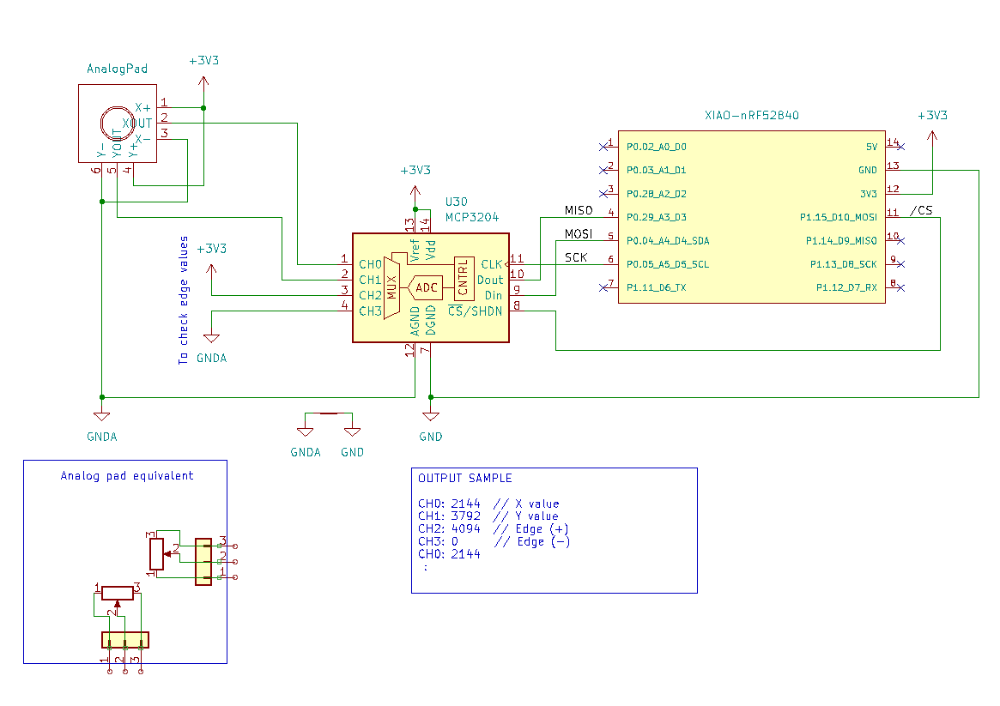

This zephyr example is for [MCP3204](https://www.microchip.com/en-us/product/mcp3204)(12bits 4ch-ADC).

For zmk firmware, I'd like to check this example on zephyr 3.5 beforehand.

## wiring


## setup
```
cd /PATH/TO/zmk/zephyr/samples/            # for zmk
cp -r ~/Downloads/zephyr-sample-mcp3204 ./mcp3204
```

## build
```
cd /PATH/TO/zmk/zephyr/samples/mcp3204     # for zmk
west build -p always -b seeeduino_xiao_ble -- -DDTC_OVERLAY_FILE=foo.overlay
```

## flash
Double click the reset button on XIAO-BLE to put it into the boot-mode.
and then:

```
west flash
```

## check output
Using `tio` as below:
```
CH0: 2144  // X value
CH1: 3792  // Y value
CH2: 4094  // Edge (+)
CH3: 0     // Edge (-) 
CH0: 2144
 :
```

## links
- [Zephyr Official Document/MCP3204](https://docs.zephyrproject.org/latest/build/dts/api/bindings/adc/microchip%2Cmcp3204.html)
